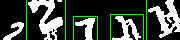
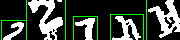
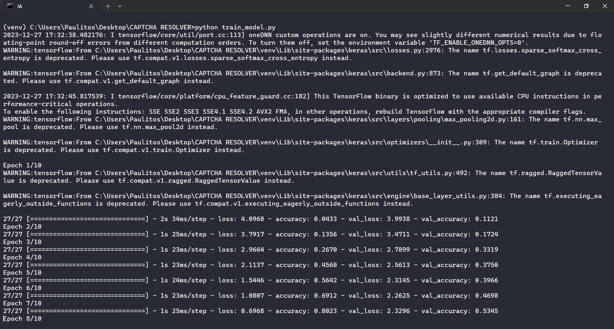
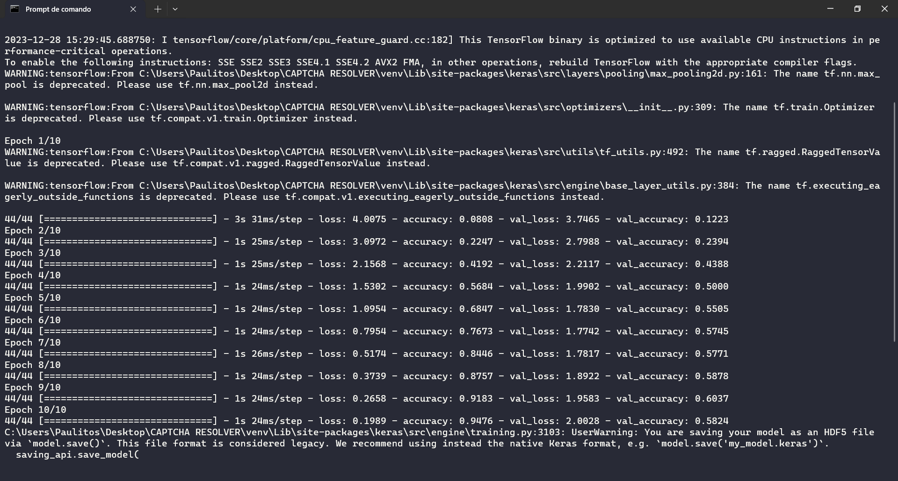

# Captcha Resolver

## Dia 01

Após 5 horas de Scrapping foram coletadas 1000 imagens pela automação.


> CAPTCHA Retirado direto do Scrapping

Para realizar os testes do dia 1 foram utilizados 10 dessas imagens.

No primeiro passo que foi transformar essas 10 imagens PNG em tons de Cinza para facilitar o reconhecimento pelo Python e retirar os ruidos da mesma,peguei o método do `cv2` o **THRESH_BINARY** que apresentou a limpeza mais consistente nessa parte(perdendo menos dados), mas obtivemos perda de 3 arquivos, pois faltou uma letra em cada um.


> CAPTCHA filtrado usando o `cv2` com o método **THRESH_BINARY**

```
N = 50 - 3 = 47

50/100 = 47/x

X = 94%
```

Mas esse 94% em si é mentiroso, pois os arquivos sem letras não vão conseguir passar pelo proximo teste então na verdade são 35 letras possiveis representando então 70%.

Na próxima etapa foi realizado a próxima etapa do ETL que foi pegar as imagens "perfeitas" e extrair as suas letras, porém nesse processo somente 4 imagens conseguiram retornar as 5 letras, ou seja, obtivemos 20 letras, representando uma perca de 60% dos dados.


> Captcha com as letras identificadas pela biblioteca do `cv2`


### Conclusão do dia

Sendo o primeiro dia de testes, conseguimos já criar a lógica por trás do ETL do Deep Learning, mas os resultados por enquanto estão insatisfatórios, pois perdemos 60% dos dados extraídos.


## Dia 02

No começo do segundo dia tentamos mudar as configurações do arquivo `etl_captcha.py` para quando a gente tentasse reduzir o ruído ele não apagasse as letras de algumas imagens, mas infelizmente não foi possivel, pois alguns ruídos estão muito próximos da coloração das letras.

Assim pro treinamento teremos 2000 letras em média, dando 32 em média para cada algoritmo

Após algumas modificações no arquivo `spell_letters.py` como adição de **Threshold Adaptativo**, **Operações Morfológicas**, **Pós-Processamento dos Contornos** e **Ajustes Dinâmico** a precisão aumentou em muito para 26 letras, porém foi percebido que ao redor da imagem tem uma linha branca nas bordas que tem atrapalhado, retirando ela podemos aumentar a área para a identificação de mais letras.


Com a modificação no `etl_captcha.py` para cortar a borda agora vamos testar novamente no `spell_letters.py` para ver se a precisão vai aumentar.

Após realizar tal ato, todas imagens tiveram as suas letras reconhecidas, mas como a área está muito grande algumas letras foram identificadas como `outliers`, então vamos diminuir a mesma para tentar fazer elas serem reconhecidas.

Foi percebido também que após o corte ele não tem percebido as letras do canto da imagem:

- Antes do corte


- Depois do corte



Após algumas modificações conseguimos fazer a IA reconhecer a letra mais a esquerda e identificar todas as letras em 90% das imagens, mas ele tem reconhecido outros lixos também, mas iremos separar o lixo para a IA.



Agora temos 46 letras para treinar a IA o que é equivalente a 92% da base de dados

### Treinamento

Foi criado um diretorio chamado `base_letters` onde tem um script chamado `create_folders.py` que criou todos diretorios para o treinamento, esse arquivo serve para criar os 61 diretorios da nossa IA.

O treino teve mais de 7 horas de duração e mesmo assim ainda não terminamos de catalogar todos os dados da base de dados.


## Dia 03

Mesmo com muitos dados não catalogados na base de dados, podemos começar a ver como a IA vai agir.

Criei o arquivo `train_model.py` e segui o artigo do **Adam Geitgey**, vou explicar melhor tudo que foi feito, quando for escrever o artigo, mas mesmo treinando com menos da metade dos dados a precisão foi de 50%, o que é maravilhoso, pois o N amostral estava em 820 dados, ou seja, uma média de 13 dados por letra, o foco é conseguir 50 dados por letra.



## Dia 04

Iniciando o dia 4 com os treinos e já obtivemos melhoras de 5% com o treino do dia anterior:



O objetivo é melhor o treino para que amanhã ele chegue em 62% ao menos.

Melhor também a varredura as imagens tentando tirar mais outliers delas.


# Referencias

https://medium.com/@ageitgey/how-to-break-a-captcha-system-in-15-minutes-with-machine-learning-dbebb035a710


