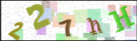

# Captcha Resolver

## Dia 01

Após 5 horas de Scrapping foram coletadas 1000 imagens pela automação.



> CAPTCHA Retirado direto do Scrapping

Para realizar os testes do dia 1 foram utilizados 10 dessas imagens.

No primeiro passo que foi transformar essas 10 imagens PNG em tons de Cinza para facilitar o reconhecimento pelo Python e retirar os ruidos da mesma,peguei o método do `cv2` o **THRESH_BINARY** que apresentou a limpeza mais consistente nessa parte(perdendo menos dados), mas obtivemos perda de 3 arquivos, pois faltou uma letra em cada um.


> CAPTCHA filtrado usando o `cv2` com o método **THRESH_BINARY**

```
N = 50 - 3 = 47

50/100 = 47/x

X = 94%
```

Mas esse 94% em si é mentiroso, pois os arquivos sem letras não vão conseguir passar pelo proximo teste então na verdade são 35 letras possiveis representando então 70%.

Na próxima etapa foi realizado a próxima etapa do ETL que foi pegar as imagens "perfeitas" e extrair as suas letras, porém nesse processo somente 4 imagens conseguiram retornar as 5 letras, ou seja, obtivemos 20 letras, representando uma perca de 60% dos dados.


> Captcha com as letras identificadas pela biblioteca do `cv2`


### Conclusão do dia

Sendo o primeiro dia de testes, conseguimos já criar a lógica por trás do ETL do Deep Learning, mas os resultados por enquanto estão insatisfatórios, pois perdemos 60% dos dados extraídos.


## Dia 02

No começo do segundo dia tentamos mudar as configurações do arquivo `etl_captcha.py` para quando a gente tentasse reduzir o ruído ele não apagasse as letras de algumas imagens, mas infelizmente não foi possivel, pois alguns ruídos estão muito próximos da coloração das letras.

Assim pro treinamento teremos 2000 letras em média, dando 32 em média para cada algoritmo

Após algumas modificações no arquivo `etl_captcha.py` como adição de **Threshold Adaptativo**, **Operações Morfológicas**, **Pós-Processamento dos Contornos** e **Ajustes Dinâmico** a precisão aumentou em muito para 26 letras, porém foi percebido que ao redor da imagem tem uma linha branca nas bordas que tem atrapalhado, retirando ela podemos aumentar a área para a identificação de mais letras.

